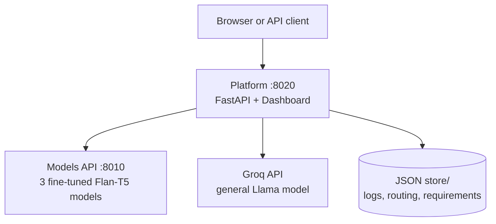
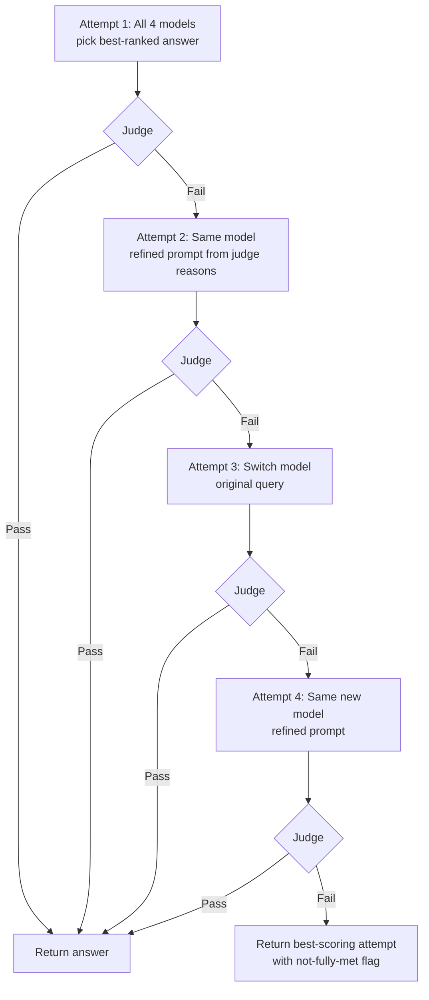

# Project Context — Deterministic Multi-Model Platform

> **Purpose of this document:** Single reference for humans and AI to understand what was built, how it works, what it depends on, and how to rebuild it. No source code—only behavior, flow, and design.

---

## 1. What This Project Is

An **AI determinism and observability platform** that does not trust a single model call. For each user question it can:

- Send the query to **multiple domain-specific models** (chemistry, Python, Gita, general)
- **Score and compare** every answer with measurable metrics
- **Pick the best response** and return full diagnostics
- **Learn over time** which model wins per domain
- **Route intelligently** so it does not always call every model
- **Self-correct** when answers fail user-defined requirements

**Core problem it addresses:** LLM outputs are non-deterministic and vary by model, prompt, and domain. This platform **explores, measures, selects, routes, and retries** instead of returning the first answer blindly.

**Design theme:** Local fine-tuned models run in **near-deterministic mode** (greedy decoding). The platform layer adds competition, evaluation, routing, and requirement checking on top.

---

## 2. Why It Was Built

| Motivation | Explanation |
|------------|-------------|
| Multi-domain coverage | One app serves chemistry, Python FAQ, Bhagavad Gita, and general Q&A—not one generic chatbot. |
| Quality via competition | Run all models + prompt variants, then rank by measurable scores. |
| Transparency | Expose per-model metrics, all responses, and aggregate stability stats. |
| Cost/latency control | Adaptive routing reduces calls once clusters are confident. |
| User intent alignment | Self-correction loop judges answers against per-client requirements and auto-retries. |
| Lightweight ops | No Docker, no database—JSON files + two Python services. |
| Demonstration | Show how evaluation + routing + learning + self-correction wrap multiple models into one API. |

---

## 3. High-Level Architecture

Two cooperating services plus optional cloud LLM:

| Service | Port | Role |
|---------|------|------|
| **Platform** (`platform/`) | 8020 | Orchestration, evaluation, routing, self-correction, UI, logging |
| **Models API** (`models_api/`) | 8010 | Serves three local fine-tuned Flan-T5 models over HTTP |
| **Groq** (external) | cloud | General-purpose `groq_model` + judges |



**Persistence:** All state in `platform/store/` as JSON files—no database, no MLflow.

---

## 4. The Four Models

| Model key | Domain | Backend |
|-----------|--------|---------|
| `organic_model` | Organic chemistry | Fine-tuned Flan-T5 (local, port 8010) |
| `python_model` | Python FAQ | Fine-tuned Flan-T5 (local) |
| `gita_model` | Bhagavad Gita | Fine-tuned Flan-T5 (local) |
| `groq_model` | General Q&A | Llama via Groq API |

Each local model uses **task-specific prefixes** at inference and **greedy decoding** for reproducibility. Training data lives in CSV files under `models_api/`; weights ship in-repo.

| Model key | Training source |
|-----------|-----------------|
| `python_model` | `faq_dataset.csv` |
| `organic_model` | `Organic_Compounds_Properties.csv` |
| `gita_model` | `Bhagvad Gita.csv` |
| `groq_model` | Pre-trained API model (not fine-tuned locally) |

**Retraining (optional):** `models_api/scripts/retrain_best_all.py`. Smoke test: `smoke_test_models.py`.

---

## 5. Repository Layout (Conceptual)

| Area | Contents |
|------|----------|
| `platform/run.py` | Starts Uvicorn; loads `.env` |
| `platform/app/main.py` | FastAPI routes (query, self-correct, routing, requirements, followup, report) |
| `platform/app/services/orchestrator.py` | Standard multi-model pipeline |
| `platform/app/services/adaptive_routing/` | Cluster classification, routing table, direct vs explore, re-exploration |
| `platform/app/services/self_correction/` | Requirements profiles, LLM judge, 4-attempt retry loop |
| `platform/app/services/followup.py` | Single-model follow-up on prior responses |
| `platform/app/evaluation/` | Semantic scoring (embeddings, grounding, optional NLI/judge) |
| `platform/app/static/` | Multi-Model Observatory dashboard |
| `platform/data/routing_seed_queries.json` | Curated queries for routing bootstrap |
| `platform/scripts/seed_routing.py` | CLI to bootstrap/verify routing clusters |
| `platform/store/` | Runtime JSON state |
| `models_api/api/main.py` | Loads and serves python/organic/gita models |
| `.env` | API keys, eval toggles, routing/self-correction thresholds |

---

## 6. Standard Query Flow (`POST /query`)

Used when **self-correction is off** in the dashboard, or when calling the API directly.

### 6.1 Entry points

1. **Dashboard:** User runs query with self-correction toggle **off** → `POST /query`.
2. **Direct API:** `http://127.0.0.1:8020/query` with `{"query": "..."}`.
3. **Optional fields:** `context` (RAG for grounding), `ground_truth` (reference accuracy), `enable_routing` (true/false), `force_explore` (cluster-scoped re-exploration).

### 6.2 Pipeline flow


| Step | Module | What happens |
|------|--------|----------------|
| 1 | `query_analyzer.py` | Keyword-based domain (`chemistry`, `python`, `gita`, `general`), complexity, intent |
| 2 | `adaptive_routing/router.py` | Classifies cluster; decides **full exploration** or **direct route** |
| 3 | `prompt_generator.py` | Three variants: concise (v1), detailed (v2), facts-only (v3) |
| 4 | `model_executor.py` | Runs selected model(s) × prompts (up to **4 × 3 = 12 calls**) |
| 5 | `evaluator.py` | Lexical + optional semantic scoring per response |
| 6 | `ranker.py` | Sorts all responses; winner becomes `best_answer` |
| 7 | `learning.py` | Updates `model_performance.json` for domain |
| 8 | `logger.py` | Appends full run to `logs.json` including routing metadata |
| 9 | Return | `best_answer`, `best_model`, `metrics`, `blue_metrics`, `analysis`, `all_responses`, `routing` |

### 6.3 Model execution

| Model | Backend |
|-------|---------|
| `organic_model` | HTTP `POST {MODELS_API}/organic` |
| `python_model` | HTTP `POST {MODELS_API}/python` |
| `gita_model` | HTTP `POST {MODELS_API}/gita` |
| `groq_model` | Groq OpenAI-compatible chat API |

Each call records response text, latency, estimated tokens, and errors. Optional **LangSmith** tracing when `LANGCHAIN_TRACING_V2=true` (observability only—not used for scoring).

### 6.4 Models API

- Loads three Hugging Face seq2seq bundles (Flan-T5) from disk.
- Greedy decoding for reproducible outputs.
- Endpoints: `/python`, `/organic`, `/gita`, plus `/ask` for keyword auto-routing inside models API alone.

---

## 7. Adaptive Query Routing

**Why:** Calling all 12 model×prompt combinations every time is slow and expensive.

**How it works:**

1. **Seed clusters:** `chemistry`, `python`, `gita`, `general` (can split into sub-clusters like `python/sub_1`).
2. **Classification:** Embedding similarity to stored query centroids; Groq LLM fallback if ambiguous.
3. **Routing table:** Per cluster tracks best model, avg accuracy/latency/confidence, sample count, mode (`exploration` vs `direct`).
4. **Direct routing threshold:** After enough samples (default 20), cluster switches to calling **one model × three prompts** (3 calls).
5. **Re-exploration:** Never permanently locked—re-triggers full exploration when accuracy/confidence drops, latency spikes, trend degrades, periodic interval elapses, or manual override.

**Modes:**

| Mode | Behavior |
|------|----------|
| Full exploration | All 4 models × 3 prompts (12 calls) |
| Direct route | Best-known model for cluster × 3 prompts (3 calls) |
| Routing disabled (toggle) | Always full exploration |

**Bootstrap:** `seed_routing.py bootstrap` or dashboard button seeds clusters with curated queries (embeddings only, no model calls) so direct routing can activate faster.

**Logged to:** `routing_table.json`, `routing_logs.json`.

**Dashboard:** Routing flow diagram, cluster grid, readiness panel, adaptive routing toggle, bootstrap/verify buttons.

---

## 8. Evaluation System (Lexical + Semantic)

Evaluation is **separate from** the requirements judge (Section 9). It scores **every model response** in the main pipeline.

### 8.1 Tier 1 — Lexical (always on)

| Metric | Meaning |
|--------|---------|
| `relevanceScore` | Share of query keywords found in response |
| Lexical overlap | Jaccard similarity between query and response |
| `accuracyScore` | 65% relevance + 35% Jaccard (capped at 1.0) |
| `hallucinationScore` | Roughly `1 − accuracy`, plus uncertainty phrase penalty |
| `confidenceScore` | Accuracy minus latency and uncertainty penalties |
| `cost` | Estimated from token count |
| `toxicityScore` | Not implemented (always 0) |

### 8.2 Tier 2 — Semantic (optional, `EVAL_ENABLE_SEMANTIC=true`)

| Metric | Meaning |
|--------|---------|
| `relevance` | Embedding cosine similarity query↔answer |
| `groundedness` | Fraction of response sentences supported by `context` |
| `hallucination` | Fraction of ungrounded sentences |
| `accuracy` | Similarity to `ground_truth` or groundedness×relevance proxy |
| `confidence` | Weighted mix of groundedness, relevance, optional entailment |
| `unsupported_sentences` | Debug list of failing sentences |

**Embedding model (default):** `sentence-transformers/all-MiniLM-L6-v2`.

**Optional add-ons:** NLI cross-encoder; Groq LLM judge for **eval** (distinct from self-correction judge).

### 8.3 Ranking

Winner = highest accuracy → lowest hallucination → lowest latency → highest confidence. Semantic ranking when enabled; otherwise lexical.

### 8.4 BLUE metrics (aggregate per query)

| Metric | Meaning |
|--------|---------|
| `behaviorStability` | Consistency of each model's 3 prompt-variant answers |
| `latency` | Mean latency across all calls |
| `usageCost` | Sum of estimated costs |
| `errorRate` | Fraction of failed calls |

---

## 9. Requirement-Driven Self-Correction Loop

**Why:** Lexical/semantic scores measure overlap and grounding—not whether the answer matched what **this user** wanted. This layer aligns output to user intent.

**Endpoint:** `POST /query/self-correct` (dashboard: self-correction toggle **on**).

### 9.1 Requirements profile (set once per use-case)

Stored in `requirements_profiles.json`, keyed by client ID (e.g. `default`):

| Field | Purpose |
|-------|---------|
| Tone & style | How answers should sound |
| Detail level | Brief vs in-depth |
| Must include | Accept if present (e.g. examples) |
| Must avoid | Reject if present (e.g. speculation) |
| Format expectations | Bullets, paragraphs, etc. |
| Domain constraints | Topic boundaries |

Captured in dashboard sidebar (**Answer requirements**) or via `PUT /requirements/{client_id}`.

### 9.2 The 4-attempt loop

Uses a **dedicated Groq LLM judge**—independent of lexical/segment evaluation.



| Attempt | Model | Prompt |
|---------|-------|--------|
| 1 | All 4 → best ranked | Original query |
| 2 | Same as attempt 1 winner | Enhanced using **specific** judge failure reasons |
| 3 | Next-best model for cluster | Original query |
| 4 | Same as attempt 3 | Enhanced from attempt 3 failures |

- Stops **immediately** on first pass.
- Hard cap at **4 attempts**—no infinite retry.
- Prompt enhancement references **specific** judge reasons—not vague "be more accurate."
- Logged to `self_correction_logs.json`.

**Dashboard:** Shows each attempt, PASS/FAIL, judge reasons, requirements profile used, final outcome.

---

## 10. Follow-Up Questions

After a standard query, user can ask a **follow-up** on a specific model response (`POST /followup`).

- Finds parent response in `logs.json` by log ID and response ID (or fuzzy match).
- Reuses the **same model** that produced the original answer.
- Builds a context-rich follow-up prompt.
- Evaluates and logs as a separate follow-up entry.

Available per response in the dashboard model response cards.

---

## 11. Web Dashboard (Multi-Model Observatory)

Single-page UI at `http://127.0.0.1:8020`:

| Area | What it shows / does |
|------|----------------------|
| **Answer requirements** | Form to save/load profile per use-case ID |
| **Ask a question** | Query input, self-correction toggle, run button |
| **Adaptive routing toggle** | Top bar—on/off for routing |
| **Routing decision** | Flow diagram, cluster, classification, models called |
| **Requirements & self-correction** | Attempt timeline, judge PASS/FAIL, reasons |
| **Best answer** | Winner text, model, prompt |
| **Aggregate metrics** | KPI cards + BLUE bar chart |
| **Model responses** | Grouped by model: prompts, metrics, full text, follow-up |
| **Routing clusters** | Live cluster state, progress to direct mode, force re-explore |
| **Routing readiness** | Bootstrap / verify direct routing |

**Two run modes:**

- **Self-correction ON** → `/query/self-correct` (requirements judge + retry loop)
- **Self-correction OFF** → `/query` (standard multi-model pipeline)

---

## 12. Learning and Reporting

### Learning (`learning.py`)

After each standard query, for the detected domain:

- Increments query count
- Running average of accuracy (prefers semantic when valid) and latency
- Sets `best_model` to the winner of this query

Feeds `model_router.py` domain bias and adaptive routing cluster stats.

### Report (`GET /report`)

Returns: best model per domain, accuracy comparison, average latency, total queries.

---

## 13. API Surface (Platform)

| Method | Path | Role |
|--------|------|------|
| GET | `/` | Dashboard UI |
| GET | `/docs` | OpenAPI/Swagger |
| POST | `/query` | Standard multi-model pipeline |
| POST | `/query/self-correct` | Requirements-driven 4-attempt loop |
| GET | `/requirements/{client_id}` | Load requirements profile |
| PUT | `/requirements/{client_id}` | Save requirements profile |
| GET | `/requirements` | List all profiles |
| POST | `/followup` | Follow-up on a prior response |
| GET | `/report` | Aggregate stats from store |
| GET | `/routing/status` | Routing table summary |
| GET | `/routing/seed/status` | Cluster readiness for direct routing |
| POST | `/routing/seed` | Bootstrap or verify routing |
| POST | `/routing/re-explore` | Force re-exploration for cluster(s) |

**Models API:** `POST /python`, `/organic`, `/gita`, `/ask` with body `{"query": "..."}`.

---

## 14. Persistence — All JSON, No Database

| File | Contents |
|------|----------|
| `logs.json` | Every standard query: analysis, routing, all responses, winner, metrics |
| `model_performance.json` | Per-domain learning: best model, avg accuracy/latency, count |
| `routing_table.json` | Per-cluster routing state, centroids, best model, mode |
| `routing_logs.json` | Every routing decision and cluster update |
| `requirements_profiles.json` | Per-client answer requirements |
| `self_correction_logs.json` | Every self-correction run: attempts, judge results, outcome |

Structured for later analytics—no log-review dashboard yet. **No MLflow.**

---

## 15. Main Implementation Areas

| Module | Responsibility |
|--------|----------------|
| `orchestrator` | Main query pipeline coordinator |
| `query_analyzer` | Domain/complexity/intent from keywords |
| `model_router` | Legacy domain→model ordering + learning bias |
| `adaptive_routing` | Cluster classification, routing table, direct vs explore, re-exploration, seed bootstrap |
| `prompt_generator` | Three prompt variants |
| `model_executor` | HTTP to Models API + Groq |
| `evaluator` + `evaluation/` | Lexical + optional semantic scoring |
| `ranker` | Sort responses best-first |
| `learning` | Update domain performance over time |
| `logger` | Write query logs |
| `followup` | Single-model follow-up path |
| `self_correction` | Requirements profiles, judge, prompt enhancement, 4-attempt loop |
| `static/` | Multi-Model Observatory dashboard |
| `models_api` | Load and serve three fine-tuned models |

---

## 16. What Works Best / Best Outcomes

| Feature | Best when | Outcome |
|---------|-----------|---------|
| **Full exploration pipeline** | New domains, comparing models, debugging | Transparent winner from up to 12 scored candidates + full diagnostics |
| **Adaptive routing** | After bootstrap (~22 samples/cluster) | 3 calls instead of 12 for known query types—much faster |
| **Self-correction loop** | User has clear requirements (tone, must-include, must-avoid) | Answers checked against intent; auto-retry up to 4 times |
| **Semantic evaluation** | `context` or `ground_truth` provided | Richer accuracy and hallucination vs keywords alone |
| **Follow-up** | Conversation on one model's answer | Same model, contextual thread, no re-running all models |
| **Domain models** | On-topic queries (benzene, Python, Gita) | Specialized fine-tuned answers beat general model |
| **Groq general model** | Off-domain or broad questions | Fallback when local models are weak |

**Strongest combined flow:**

1. Set **requirements** once in the dashboard.
2. **Bootstrap routing** so clusters reach direct mode.
3. Run queries with **self-correction ON** and **adaptive routing ON**.
4. System routes cheaply when confident, judges against requirements, and retries automatically.

---

## 17. Technology Stack

### Platform dependencies

FastAPI, Uvicorn, httpx, python-dotenv, numpy, torch, transformers, sentence-transformers, langchain/langsmith (optional tracing).

### Models API dependencies

torch, transformers, accelerate, datasets, pandas, FastAPI, sentencepiece.

### External services

| Service | Required? | Purpose |
|---------|-----------|---------|
| Groq API | Yes (for `groq_model` and judges) | General model + LLM judges |
| LangSmith | Optional | Trace model calls |
| Local Models API | Yes for 3 domain models | Port 8010 |

---

## 18. Configuration (Environment Variables)

Key variables (see `.env`):

| Variable | Typical value | Effect |
|----------|---------------|--------|
| `API_HOST`, `API_PORT` | `0.0.0.0`, `8020` | Platform bind |
| `MODELS_API_BASE_URL` | `http://127.0.0.1:8010` | Local models server |
| `GROQ_API_KEY`, `GROQ_MODEL` | — | Groq general model + judges |
| `EVAL_ENABLE_SEMANTIC` | `true` | Semantic pipeline on/off |
| `USE_SEMANTIC_RANKING` | `true` | Rank by semantic vs lexical |
| `ROUTING_MIN_SAMPLES_FOR_DIRECT_ROUTING` | `20` | Samples before direct route |
| `ROUTING_EMBEDDING_SIMILARITY_THRESHOLD` | `0.55` | Cluster match threshold |
| `SELF_CORRECTION_JUDGE_PASS_THRESHOLD` | `0.75` | Judge pass score |
| `REQUIREMENTS_PROFILE_REQUIRED` | `false` | Reject query if no profile |
| `LANGCHAIN_TRACING_V2` | optional | LangSmith traces |

Routing and self-correction thresholds are defined as named constants in their respective config modules—all env-overridable.

---

## 19. How to Run

**Prerequisites:** Python 3.10+, pip, Groq API key.

1. Copy project; create `.env`; set `GROQ_API_KEY`.
2. Install `models_api/requirements.txt`; start Models API on port **8010**.
3. Install `platform/requirements.txt`; run `python platform/run.py` on port **8020**.
4. Open `http://127.0.0.1:8020`.
5. Save requirements profile → optionally bootstrap routing → run queries.

**Routing bootstrap (optional):**

```bash
cd platform
../.venv/bin/python scripts/seed_routing.py bootstrap
../.venv/bin/python scripts/seed_routing.py verify
```

---

## 20. What This Project Is Not

- Not a single chatbot—it is a **multi-model competition and observability** layer.
- Not MLflow-based—all storage is **local JSON**.
- Not consensus/ensemble answering—it **picks one best response**.
- Not unlimited retry—self-correction is **exactly 4 attempts**.
- Not modifying model weights at runtime—learning updates **routing and domain stats**, not fine-tuning.

---

## 21. Known Limitations

| Issue | Detail |
|-------|--------|
| Cost and latency (explore mode) | Up to **12 model calls** per standard query when routing explores. |
| Keyword domain detection | Easy to misclassify edge cases; routing uses embeddings to improve. |
| Learning simplicity | `best_model` is last winner per domain/cluster—not a full RL policy. |
| Grounding without context | Hallucination may be underestimated if `context` omitted. |
| Lexical metrics | Weak for paraphrased correct answers. |
| No auth / multi-tenant | Open local API; not production-hardened. |
| Single-machine JSON store | Not concurrency-safe for high traffic. |
| Models API dependency | Port 8010 down → three local models fail (Groq may still work). |
| Self-correction cost | Up to 4 judge calls + multiple model calls per query. |

Acceptable for demo/research; main gaps for production.

---

## 22. Future Scope (Suggested Extensions)

| Direction | Benefit |
|-----------|---------|
| Reduce explore calls further | Early stopping when one model scores above threshold |
| Fine-tuned routing classifier | Replace embedding+LLM fallback with trained router |
| Real RAG pipeline | Auto-fill `context` before grounding checks |
| Async parallel execution | Run model calls concurrently |
| Database for logs | Postgres/SQLite instead of JSON |
| Auth and rate limits | Production deployment |
| Self-correction analytics | Dashboard for pass rates by attempt number |
| DeepEval integration | Standardized eval framework via env flag |

---

## 23. Mental Model for Rebuilding

1. **Two FastAPI apps**—one orchestrates, one serves weights.
2. **Every query is a tournament** (explore mode): many (model, prompt) pairs compete; evaluation is the referee; ranker picks the champion.
3. **Adaptive routing** learns when the tournament can shrink to one model.
4. **Self-correction** adds a requirements judge and fixed 4-attempt retry on top.
5. **Two scoring layers for eval:** fast lexical always; slow semantic optional.
6. **State is JSON files:** logs, performance, routing, requirements, self-correction.
7. **Determinism where possible:** local models greedy; platform adds structured comparison on top.

This document plus `README.md` should be sufficient for an AI or developer to recreate the architecture, data flow, metrics, and deployment without reading every source file.
